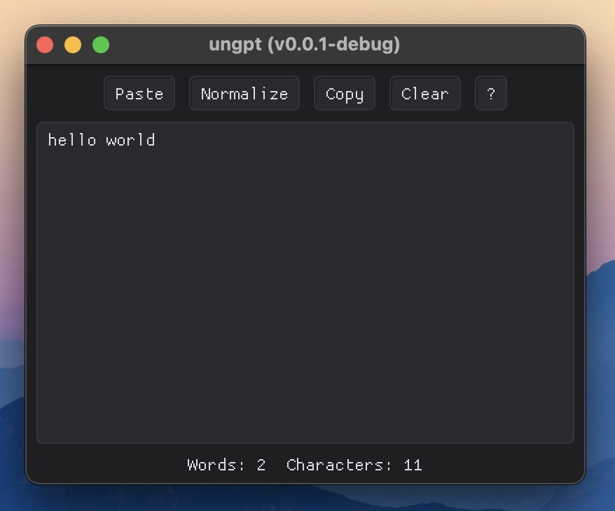

# ungpt

[](https://github.com/ryouze/ungpt/actions/workflows/ci.yml)
[](https://github.com/ryouze/ungpt/actions/workflows/release.yml)


A cross-platform GUI app that converts ChatGPT's smart punctuation and symbols to plain ASCII.



## Motivation

I often use ChatGPT to correct grammar and spelling errors because it's smarter than a regular spell checker.

However, it frequently outputs text containing "smart" punctuation and typographic Unicode symbols, such as:

- Em dashes (`—`) instead of ASCII dashes (`-`)
- Curly quotes (`“ ” ‘ ’`) instead of straight quotes (`" '`)
- Ellipses (`…`) instead of three dots (`...`)

Manually fixing these with Find & Replace is tedious. I do it so often that I decided to build a small app to automate the process.

I chose SFML and ImGui because I wanted to cobble something together quickly.

## Features

- Written in modern C++ (C++20).

## Tested Systems

This project has been tested on the following system:

- macOS 15.7 (Sequoia)

Automated tests are also run on the latest versions of macOS, GNU/Linux, and Windows using GitHub Actions.

## Pre-built Binaries

Pre-built binaries are available for macOS (ARM64), GNU/Linux (x86_64), and Windows (x86_64). You can download the latest version from the [Releases](../../releases) page.

To remove the quarantine attribute on macOS, use the following commands:

```sh
xattr -d com.apple.quarantine ungpt-macos-arm64.app
chmod +x ungpt-macos-arm64.app
```

On Windows, the OS may warn you that the binary is unsigned. You can bypass this warning by clicking "More info" and then "Run anyway".

## Requirements

To build and run this project, you'll need:

- C++20 or higher
- CMake

## Build

1. **Clone the repository**:

   ```sh
   git clone https://github.com/ryouze/ungpt.git
   ```

2. **Generate the build system**:

   ```sh
   cd ungpt
   mkdir build && cd build
   cmake ..
   ```

   The default configuration (`cmake ..`) is recommended for most users and is also used by CI/CD to build the project.

   However, the build configuration can be customized using the following options:

   - `ENABLE_COMPILE_FLAGS` (default: ON) - Enables strict compiler warnings and treats warnings as errors. When enabled, any compiler warning causes the build to fail. Disable this option if warnings cause compilation issues.
   - `ENABLE_STRIP` (default: ON) - Strips debug symbols from Release builds to reduce binary size. Disable this option to preserve debugging information. Only affects Release builds.
   - `ENABLE_LTO` (default: ON) - Enables Link Time Optimization for Release builds, which can produce smaller and faster binaries. It is automatically disabled if the compiler does not support LTO.
   - `ENABLE_CCACHE` (default: ON) - Uses ccache, if installed, to speed up rebuilds. If ccache is unavailable, the build continues without it.
   - `BUILD_TESTS` (default: OFF) - Builds unit tests alongside the main executable. See [Testing](#testing) for usage.

   For example, to disable strict compiler flags and LTO:

   ```sh
   cmake .. -DENABLE_COMPILE_FLAGS=OFF -DENABLE_LTO=OFF
   ```

3. **Compile the project**:

   ```sh
   cmake --build . --parallel
   ```

After a successful build, you can run the program using `./ungpt` (`open ungpt.app` on macOS). However, installing the program is recommended so that it can be run from any directory. See the [Install](#install) section below.

> [!TIP]
> The build type is set to `Release` by default. To build in `Debug` mode, use `cmake .. -DCMAKE_BUILD_TYPE=Debug`.

## Install

If you haven't already built the project, follow the steps in the [Build](#build) section and make sure you are in the `build` directory.

To install the program, use the following command:

```sh
sudo cmake --install .
```

On macOS, this installs the program to `/Applications`. You can then run `ungpt.app` from Launchpad, Spotlight, or by double-clicking the app in Finder.

## Usage

1. Click `Paste` to load text from the clipboard.
2. Click `Normalize` to modify the text in place.
3. Click `Copy` to write the text to the clipboard.

## Development

### Logging

The application uses [spdlog](https://github.com/gabime/spdlog) for logging.

In Debug builds, the logging level is set to `debug` by default, which produces verbose output. In Release builds, it remains at the default `info` level, which displays only informational messages and warnings.

> [!NOTE]
> While `cmake/External.cmake` defines `SPDLOG_ACTIVE_LEVEL=SPDLOG_LEVEL_DEBUG` in Debug builds, this only affects compile-time filtering. Runtime verbosity is controlled by `spdlog::set_level()`, which is called in `main.cpp` to enable `debug`-level messages.

### Testing

Tests are included in the project but are not built by default.

To enable and build the tests manually, run the following commands from the `build` directory:

```sh
cmake .. -DBUILD_TESTS=ON
cmake --build . --parallel
ctest --verbose
```

## Credits

**Libraries:**

- [Simple and Fast Multimedia Library](https://github.com/SFML/SFML) - Windowing, graphics, input, etc.
- [Dear ImGui](https://github.com/ocornut/imgui) - Immediate-mode GUI.
- [ImGui-SFML](https://github.com/SFML/imgui-sfml) - ImGui-to-SFML binding.
- [snitch](https://github.com/snitch-org/snitch) - Unit-testing framework.
- [spdlog](https://github.com/gabime/spdlog) - Logging library.

**Graphics:**

- [Spelling Alphabet](https://macosicons.com/#/u/plantaclaus) - Application icon.
